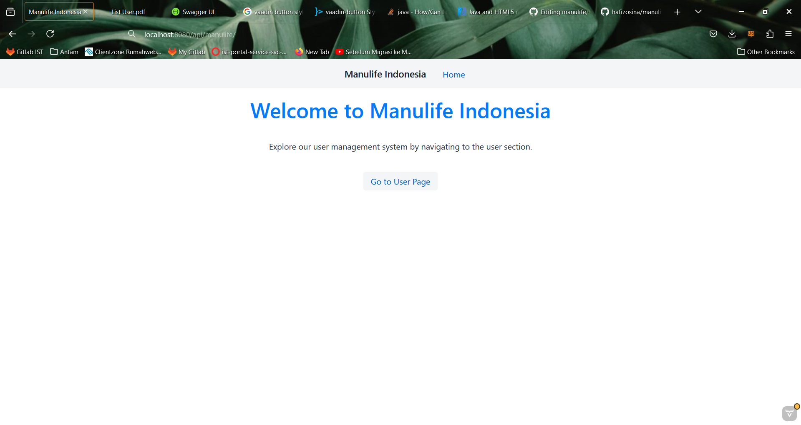
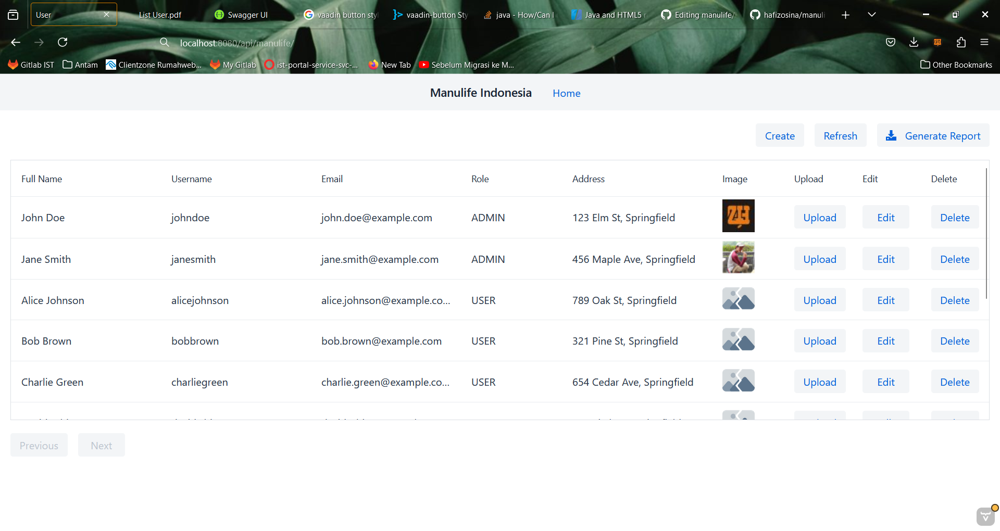
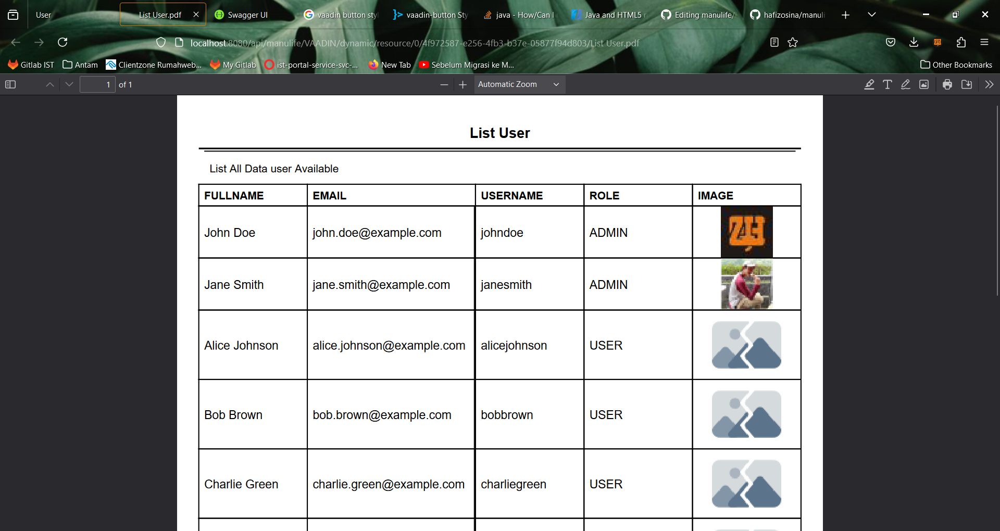

# Manulife Indonesia Project

Welcome to the Manulife Indonesia project! This project is built using Java Spring Boot and follows a microservices architecture.

## Table of Contents
- [Prerequisites](#prerequisites)
- [Installation](#installation)
- [Running the Application](#running-the-application)
- [Accessing the Application](#accessing-the-application)
- [API Documentation](#api-documentation)

## Prerequisites

Before running the application, ensure you have the following installed:
- **Java JDK 17** or higher
- **Maven 3.6.0** or higher
- **Git** (optional, for cloning the repository)

## Installation

1. Clone the repository:

   ```bash
   git clone https://github.com/hafizosina/manulife.git
   ```
2. Navigate to the project directory:
  ```bash
  cd manulife
  ```
3. Install the required dependencies using Maven:
   ```bash
   mvn clean install
   ```
## Running the Application

To run the application, use the following command:

   ```bash
  mvn spring-boot:run
   ```
This will start the application on your local machine.

## Accessing the Application

Once the application is running, open your web browser and navigate to:

```bash
http://localhost:8080/api/manulife/
```
This will take you to the main web app.


1. Click on 'Go to User Page' to access the User Management

2. Click on 'Create' Button to create new User
3. Click on 'Update' Button to update data user
4. Click on 'Delete' Button to delete existing User
5. Click on 'Upload' Button to upload user image
6. Lastly, you can click on 'Generate Report' to download the report of all user
7. 

## API Documentation

For API documentation, you can access via
```bash
http://localhost:8080/api/manulife/swagger-ui/index.html#
```
